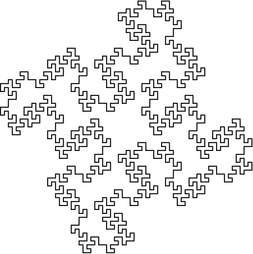
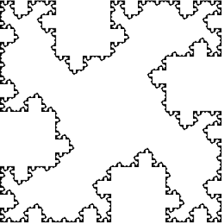

## L-systems

My goal is to implement all features of the L-system described in 'Algorithmic
Beauty of Plants' (ABOP). The input will be from files using the grammar
described in ABOP. The result will be either an SVG (for 2D models) or
something else for 3D (I haven't settled on a format yet, but should be
something that can be read by Blender).

## Examples

### DOL-systems

``` haskell
import Lsystem

render' :: String -> System -> IO ()
render' = renderSystem (400,400)

main :: IO ()
main = do
  render' "s1.svg" $ transDolSys "F-F-F-F" "F-F+F-F+F"                      3
  render' "s2.svg" $ transDolSys "F-F-F-F" "F+FF-FF-F-F+F+FF-F-F+F+FF+FF-F" 2
  render' "s3.svg" $ transDolSys "F-F-F-F" "FF-F--F-F"                      3
  render' "s4.svg" $ transDolSys "F-F-F-F" "F-F-F+F+F-F-F+F+F"              3
  render' "s5.svg" $ transDolSys "F-F-F-F" "FF+F+F-FFF-FFF-FFF-F+F+FF"      2
  render' "s6.svg" $ transDolSys "F-F-F-F" "F+F+F-F-F+F-F-F+F-F-F+F+F"      3
  render' "s7.svg" $ transDolSys "F-F-F-F" "FF-F+F+F-F"                     4
  render' "s8.svg" $ transDolSys "F-F-F-F" "FF-F-F+F+F-F+F+F-F+F+F-F-FF"    4
  render' "s9.svg" $ transDolSys "F"       "F+F-F-F+F"                      5
```








