[](http://github.com/badges/stability-badges)
[](https://zenodo.org/badge/latestdoi/101977575)

## L-systems

`Lsystem` is inspired by the book 'Algorithmic Beauty of Plants' (ABOP) by
Prusinkiewcz and Lindenmayer. Most of the systems described in the book can be
implemented with this package (and the missing features are coming soon).
`Lsystem` is quite general, supporting context-dependent, parameterized,
stochastic L-systems. I will write specific documentation when the feature set
is stable.

## Examples

### DOL-systems

Specifying systems in `Lsystem` is currently a bit verbose (see the examples in
the following sections), but there are special handlers for the simplest
systems. Eventually I will write a full parser for the specification language
used in ABOP.

DOL-systems are deterministic, context-free, non-branching, and 2D. They can be
expressed with the following 3 characters:

 1. 'F' - draw a line forward
 2. '-' - turn left
 3. '+' - turn right

With each iteration of the system, each 'F' is replaced by a new string. In
ABOP syntax, the first example below can be specified as

```
n=3 d=90
F-F-F-F

F -> F-F+F-F+F
```

where `n` is the number of steps to take, `d` is the degree of the turns,
`F-F-F-F` is the original string, and `F -> F-F+F-F+F` is a rule for replacing
`F` at each step. These systems can be used to generate simple fractal images.

``` haskell
import Lsystem
import System.Random

render' :: String -> System -> IO ()
render' = renderSystem (mkStdGen 42) (400,400)

main :: IO ()
main = do
  render' "d1.svg" $ transDolSys 3 90 "F-F-F-F" "F-F+F-F+F"
  render' "d2.svg" $ transDolSys 2 90 "F-F-F-F" "F+FF-FF-F-F+F+FF-F-F+F+FF+FF-F"
  render' "d3.svg" $ transDolSys 3 90 "F-F-F-F" "FF-F--F-F"
  render' "d4.svg" $ transDolSys 3 90 "F-F-F-F" "F-F-F+F+F-F-F+F+F"
  render' "d5.svg" $ transDolSys 2 90 "F-F-F-F" "FF+F+F-FFF-FFF-FFF-F+F+FF"
  render' "d6.svg" $ transDolSys 3 90 "F-F-F-F" "F+F+F-F-F+F-F-F+F-F-F+F+F"
  render' "d7.svg" $ transDolSys 4 90 "F-F-F-F" "FF-F+F+F-F"
  render' "d8.svg" $ transDolSys 4 90 "F-F-F-F" "FF-F-F+F+F-F+F+F-F+F+F-F-FF"
  render' "d9.svg" $ transDolSys 5 90 "F"       "F+F-F-F+F"
```

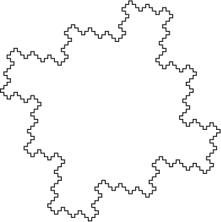


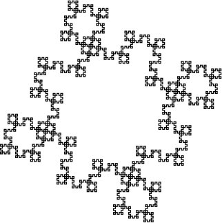


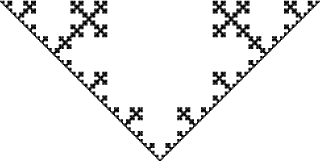


### Stochastic systems

L-systems can be made stochastic be adding probabilistic rules. A probabilistic
rule is a set of rules associated with probabilities, where the probabilities
must sum to a number less than or equal to 1 (with the implicit default rule
of N -> N making up the difference).


``` haskell
import Lsystem
import System.Random

render' :: String -> System -> IO ()
render' = renderSystem (mkStdGen 42) (400,400)

-- Where the arguments are:
--  1. number of steps
--  2. angle
--  3. initial state
--  4. weighted list of random replacements
s1 = transSolSys 12 45 "F" [(0.4, "FF"), (0.5, "-F"), (0.1, "FF-FF-FF-FF")]

main :: IO ()
main = do
  render' "s1.svg" s1
```

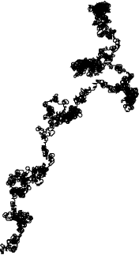

### Branching

I currently don't have any sugar for branching. So I will do this the hard way.

``` haskell
import Lsystem
import System.Random

render' :: String -> System -> IO ()
render' = renderSystem (mkStdGen 42) (400,400)

-- -- This example is taken from ABOP pp. 25
-- n=5 d=25.7
-- F -> F[+F]F[-F]F

b1 = System {
      systemBasis = [NodeDraw [] 1] -- F
    , systemRules = [               -- F[+F]F[-F]F
        DeterministicRule {
            ruleContext = ignoreContext
          , ruleCondition = unconditional
          , ruleMatch = matchF
          , ruleReplacement = constantReplacement [
                NodeDraw [] 1 ------------------ F
              , NodeBranch [[ ------------------ [+F]
                    NodeRotate [] (-25.7) 0 0
                  , NodeDraw [] 1
                ]]
              , NodeDraw [] 1 ------------------ F
              , NodeBranch [[ ------------------ [-F]
                    NodeRotate [] 25.7 0 0
                  , NodeDraw [] 1
                ]]
              , NodeDraw [] 1 ------------------ F
            ]
        }
      ]
    , systemSteps = 5
  }

main :: IO ()
main = do
  render' "b1.svg" b1
```

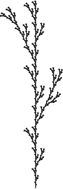


### Stochastic branching

Putting together the previous two examples, we can make more plant-like constructions


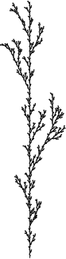
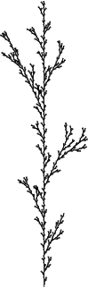
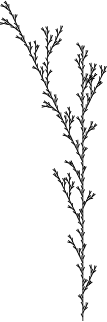
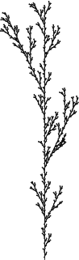


### Node rewriting and dummy variables

``` haskell
-- n=5 f=22.5
-- X
-- X -> F-[[X]+X]+F[+FX]-X
-- F -> FF

dummy = System {
      systemBasis = [x]
    , systemRules = [
        DeterministicRule {
            ruleContext = ignoreContext
          , ruleCondition = unconditional
          , ruleMatch = matchDummy [] "X"
          , ruleReplacement = constantReplacement [
                f, m                                   -- F-
              , NodeBranch [[NodeBranch [[x]], p, x]]  -- [[X]+X]
              , p, f                                   -- +F
              , NodeBranch [[p,f,x]]                   -- [+FX]
              , m, x                                   -- -X
            ]
        },
        DeterministicRule {
            ruleContext = ignoreContext
          , ruleCondition = unconditional
          , ruleMatch = matchF
          , ruleReplacement = constantReplacement [f,f]
        }
      ]
    , systemSteps = 5
  } where
  p = NodeRotate [] 22.5    0 0
  m = NodeRotate [] (-22.5) 0 0
  f = NodeDraw [] 1
  x = NodeDummy [] "X"
```

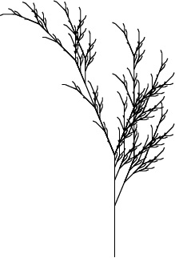

### Contextual L-systems

``` haskell
-- n=26 d=25.75
-- ignore  +-F
-- F1F1F1
--
-- 0 0 0 -> 0
-- 0 0 1 -> 1[+F1F1]
-- 0 1 0 -> 0
-- 0 1 1 -> 1
-- 1 0 0 -> 0
-- 1 0 1 -> 1F1
-- 1 1 0 -> 0
-- 1 1 1 -> 0
-- * - * -> +
-- * + * -> -

contextual = System {
      systemBasis = [f,a,f,b,f,b]
    , systemRules = [
          StochasticRule [(0.97, DeterministicRule c000          unconditional isA [b]                              )] -- 0 0 0 -> 1
        , StochasticRule [(0.97, DeterministicRule c001          unconditional isA [a]                              )] -- 0 0 1 -> 0
        , StochasticRule [(0.97, DeterministicRule c010          unconditional isB [a]                              )] -- 0 1 0 -> 0
        , StochasticRule [(0.97, DeterministicRule c011          unconditional isB [b,f,b]                          )] -- 0 1 1 -> 1F1
        , StochasticRule [(0.97, DeterministicRule c100          unconditional isA [b]                              )] -- 1 0 0 -> 1
        , StochasticRule [(0.97, DeterministicRule c101          unconditional isA [b, NodeBranch [[ p,f,b,f,b ]]]  )] -- 1 0 1 -> 1[+F1F1]
        , StochasticRule [(0.97, DeterministicRule c110          unconditional isB [b]                              )] -- 1 1 0 -> 1
        , StochasticRule [(1.00, DeterministicRule c111          unconditional isB [a]                              )] -- 1 1 1 -> 0
        , StochasticRule [(0.97, DeterministicRule ignoreContext unconditional isP [m]                              )] -- * - * -> +
        , StochasticRule [(0.98, DeterministicRule ignoreContext unconditional isM [p]                              )] -- * + * -> -
      ]
    , systemSteps = 27
  } where

  f = NodeDraw [] 1
  a = NodeDummy [] "0"
  b = NodeDummy [] "1"
  p = NodeRotate []   25.75  0 0
  m = NodeRotate [] (-25.75) 0 0

  ss = [p,m,f]

  isA = matchDummy [] "0"
  isB = matchDummy [] "1"

  isP :: Node -> a -> Maybe a
  isP (NodeRotate _ a _ _) x | a > 0 = Just x
                             | otherwise = Nothing
  isP _ _ = Nothing

  isM :: Node -> a -> Maybe a
  isM (NodeRotate _ a _ _) x | a < 0 = Just x
                             | otherwise = Nothing
  isM _ _ = Nothing
  
  c000 = contextMatch ss [a] [a]
  c001 = contextMatch ss [a] [b]
  c010 = contextMatch ss [a] [a]
  c011 = contextMatch ss [a] [b]
  c100 = contextMatch ss [b] [a] 
  c101 = contextMatch ss [b] [b] 
  c110 = contextMatch ss [b] [a] 
  c111 = contextMatch ss [b] [b] 
```


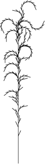
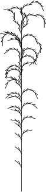


### Parametric Systems

The replacement string is a function of the original symbol and the context.
Each symbol holds a vector of doubles, which can be used pass extra
information. This example comes from ABOP pp. 47.

``` haskell
par1 = System {
      systemBasis = basis
    , systemRules = [
        DeterministicRule {
              ruleContext     = ignoreContext
            , ruleCondition   = unconditional
            , ruleMatch       = matchDummy "A"
            , ruleReplacement = r_repl
          }
      ]
    , systemSteps = 10
  } where

  r = 1.456

  p = NodeRotate []   85  0 0
  m = NodeRotate [] (-85) 0 0

  -- A(1)
  basis = [NodeDummy [1] "A"]

  -- F(s)[+A(s/R)][-A(s/R)]
  r_repl _ _ (NodeDummy [s] _) = [
         NodeDraw [] s                          -- F(s)
      ,  NodeBranch [
             [p, NodeDummy [s/r] "A"]  -- [+A(s/R)]
           , [m, NodeDummy [s/r] "A"]  -- [-A(s/R)]
         ] 
    ]
```

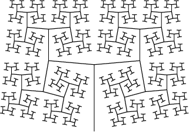


```
#define c  1.0
#define p  0.3  
#define q  c - p
#define h  sqrt (p * q)

w : f(0,1)

p1 : F(x,t) : t = 0 : F(x*p, 2) + F(x*h, 1) -- F(x*h, 1) + F(x*q, 0)
p2 : F(x,t) : t > 0 : F(x, t-1)
```


``` haskell
par2 = System {
      systemBasis = basis
    , systemRules = [
          DeterministicRule {
                ruleContext     = ignoreContext
              , ruleCondition   = r1_cond
              , ruleMatch       = isF
              , ruleReplacement = r1_repl
            }
        , DeterministicRule {
                ruleContext     = ignoreContext
              , ruleCondition   = r2_cond
              , ruleMatch       = isF
              , ruleReplacement = r2_repl
            }
      ]
    , systemSteps = 8
  } where

  c = 1.0
  p = 0.3  
  q = c - p
  h = sqrt (p * q)

  p' = NodeRotate []   86  0 0
  m' = NodeRotate [] (-86) 0 0

  -- f(0,1)
  basis = [NodeDraw [0] 1]

  -- t = 1
  r1_cond _ _ (NodeDraw [t] _) x
    | t == 0 = Just x
    | otherwise = Nothing
  r1_cond _ _ _ _ = Nothing

  -- F(x*p, 2) + F(x*h, 1) - - F(x*h, 1) + F(x*q, 0)
  r1_repl _ _ (NodeDraw [t] x) = [
         NodeDraw [2] (x*p) -- F(x*p, 2)
       , p'                 -- +
       , NodeDraw [1] (x*h) -- F(x*h, 1)
       , m'                 -- -
       , m'                 -- -
       , NodeDraw [1] (x*h) -- F(x*h, 1)
       , p'                 -- +
       , NodeDraw [0] (x*q) -- F(x*q, 0)
    ]

  -- t > 0
  r2_cond _ _ (NodeDraw [t] _) x
    | t > 0 = Just x
    | otherwise = Nothing
  r2_cond _ _ _ _ = Nothing

  -- F(x, t-1)
  r2_repl _ _ (NodeDraw [t] x) = [ NodeDraw [t-1] x ]
```


## Modeling trees

Modeling realistic trees requires two new features: variation in line width and
3-dimensional systems. This example is taken from ABOP pp. 60.

```
#define d1 94.74     /* divergence angle 1  */
#define d2 132.62    /* divergence angle 2  */
#define a  18.95     /* branching angle     */
#define lr 1.109     /* elongation rate     */
#define vr 1.732     /* width increase rate */

w = !(1)F(200)/(45)A
A    : * -> !(vr )F(50)[&(a)F(50)A]/(d1)
            [&(a)F(50)A]/(d2)[&(a)F(50)A]
F(l) : * -> F(l*lr )
!(w) : * -> !(w*vr )
```


## TODO

 - [x] deterministic
 - [x] stochastic
 - [x] branching
 - [x] dummy variables
 - [x] context sensitive
 - [x] parametric
 - [x] stochastic sugar
 - [x] deterministic sugar
 - [ ] branching sugar
 - [ ] parametric sugar
 - [ ] context sensitive sugar
 - [x] 2D visualization
 - [ ] 3D handling
 - [ ] 3D visualization
 - [ ] animation
 - [ ] polygons
 - [ ] colors and such
 - [ ] ABOP language parsing
